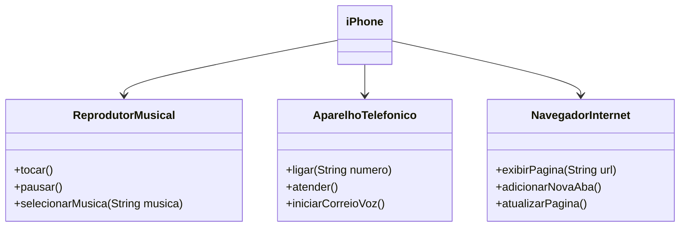

# POO - Desafio

Desafio de POO da trilha de Java Básico do DIO, a descrição do desafio se encontra [aqui](https://github.com/digitalinnovationone/trilha-java-basico/tree/main/desafios/poo)

## Diagrama

